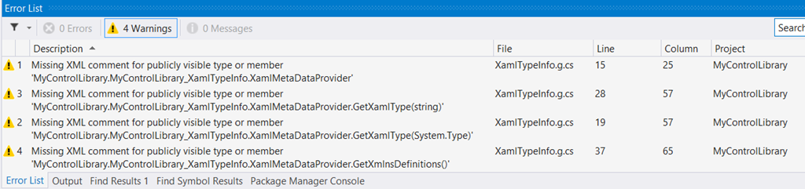

XamlTypeInfoBuildTask
=====================

Build task that fixes the auto-generated 'XamlTypeInfo' build warnings:



## Available at Nuget!
https://www.nuget.org/packages/XamlTypeInfoBuildTask

```
PM> Install-Package XamlTypeInfoBuildTask 
```

Full description of this here: http://www.sharpgis.net/post/2014/06/26/Fixing-Visual-Studios-auto-generated-code.aspx
